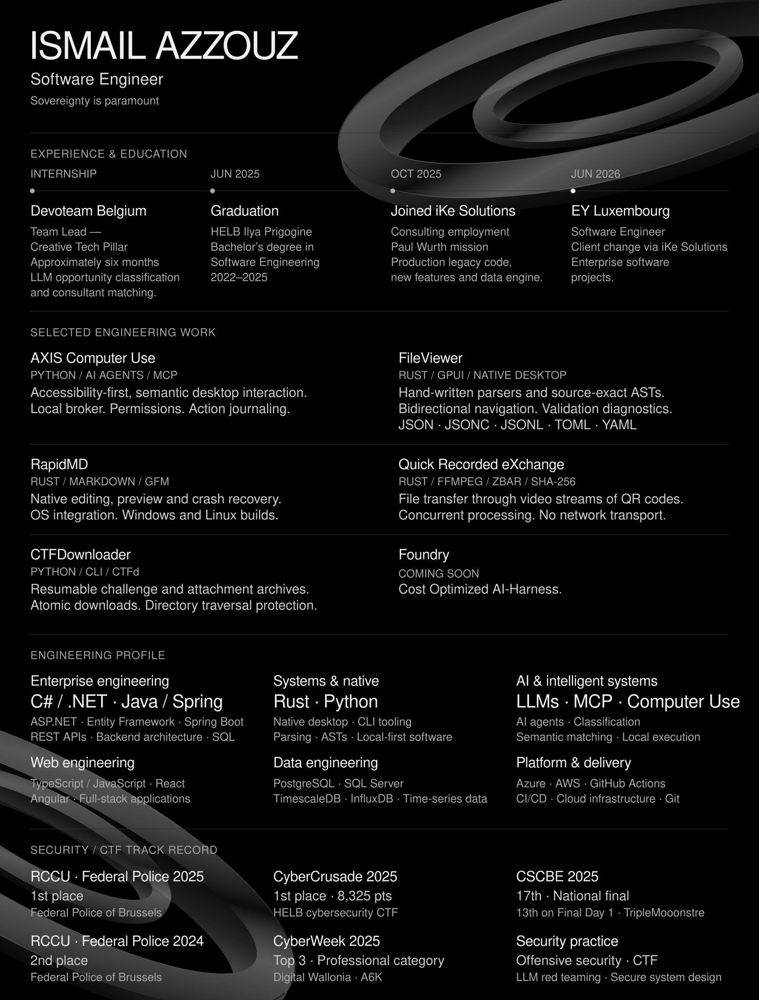

Read the text version

# Ismail Azzouz

**Software Engineer · Systems · AI · Security · Developer tooling**

I build native tools in Rust and AI infrastructure in Python, with a focus on data systems, user control and software that remains useful independently.

## Sovereignty is paramount

**Local-first. External when justified. Ownership by default.**

I aim to build systems that remain useful when a network, vendor or subscription disappears. That means keeping data under the user's control, supporting offline operation and self-hosting where practical, and treating privacy and resilience as design properties.

Dependencies should earn their place. I weigh local execution against performance, complexity and predictable cost, and use external services when they provide real technical value.

## Experience

Consulting through **iKe Solutions** since October 2025, with separate client missions at Paul Wurth and EY Luxembourg.

### EY Luxembourg

**Software Engineer · Since June 2026 · Mission through iKe Solutions**

Working on enterprise software projects at EY Luxembourg.

### Paul Wurth

**Previous mission through iKe Solutions**

Maintained and evolved a production legacy codebase, implemented new functionality, and designed and built a data engine for new application requirements in an industrial context.

### Devoteam Belgium

**Team Lead — Creative Tech Pillar · Internship, approximately six months**

Led a project using LLMs to classify client opportunities and compare their requirements against Devoteam's consultant database. Semantic matching and scoring identified relevant profiles, with the goal of improving the chances that clients would accept proposed consultants.

**Education:** Bachelor's degree in Software Engineering — HELB Ilya Prigogine, 2022–2025. Graduated in June 2025.

## Selected engineering work

### AXIS Computer Use

**Python · AI agents · MCP · Desktop automation**

A Windows-first computer-use engine for autonomous agents, built around accessibility and semantic desktop interaction. A local broker, permission boundaries and action journaling keep desktop execution under user control.

[Explore AXIS →](https://github.com/IsmailAzzouz/axis-computer-use)

### FileViewer

**Rust · GPUI · Parsing · Native desktop**

A GPU-accelerated viewer and editor for JSON, JSONC, JSONL, TOML and YAML. Hand-written parsers produce an AST with exact source spans, enabling bidirectional tree/source navigation and validation diagnostics.

[Explore FileViewer →](https://github.com/IsmailAzzouz/FileViewer)

### RapidMD

**Rust · Markdown / GFM · Native desktop**

A local Markdown editor and viewer with editing, preview and syntax highlighting. Crash recovery, OS integration and Windows/Linux builds make it a practical native writing tool.

[Explore RapidMD →](https://github.com/IsmailAzzouz/RapidMD)

### Quick Recorded eXchange — QRX

**Rust · FFmpeg · ZBar · Concurrency · SHA-256**

Transfers arbitrary files through video streams of QR codes, without a network transport. Encoding, concurrent video processing, payload reconstruction and SHA-256 validation support offline and air-gapped transfer.

[Explore QRX →](https://github.com/IsmailAzzouz/Quick-Recorded-eXchange)

### CTFDownloader

**Python · CLI · CTFd · Security tooling**

Archives CTFd challenges and attachments with token or session authentication. Resumable, atomic downloads, rate limiting and directory traversal protection make the automation resilient.

[Explore CTFDownloader →](https://github.com/IsmailAzzouz/CTFDownloader)

### Foundry

**Coming soon.**

## Security practice

Cybersecurity informs how I build and test software. My practice includes CTFs, offensive security in authorized environments, AI security and LLM red teaming.

- **CyberCrusade 2025 — 1st place**, with Chakir Kharraz, Lenny Soltan and Romain Cormontagne.
- **CSCBE 2025 — 17th in the final national ranking**, with team TripleMooonstre.
- **CyberWeek 2025 — Professional category podium.**

## Technical capabilities

Rust and Python are the most representative of my recent work. The map below groups the technologies and concepts used across my projects and professional experience.

| Area | Focus |
| :--- | :--- |
| Languages | **Rust, Python**; C#, Java, JavaScript / TypeScript |
| Systems & tooling | Native desktop, GPUI, hand-written parsers, ASTs, CLI tools, FFmpeg, ZBar |
| AI | LLM applications, AI agents, MCP, computer use, classification, semantic matching |
| Data | Data engines; experience with or exposure to PostgreSQL, TimescaleDB, InfluxDB, SQL Server |
| Backend | ASP.NET, Entity Framework, Spring Boot, Django |
| Security | CTF, authorized offensive security, LLM red teaming, permission boundaries, defensive tooling |

## Contact

Find my public work on [GitHub](https://github.com/IsmailAzzouz), or join a discussion in one of the repositories above.

  

[AXIS](https://github.com/IsmailAzzouz/axis-computer-use) · [FileViewer](https://github.com/IsmailAzzouz/FileViewer) · [RapidMD](https://github.com/IsmailAzzouz/RapidMD) · [QRX](https://github.com/IsmailAzzouz/Quick-Recorded-eXchange) · [CTFDownloader](https://github.com/IsmailAzzouz/CTFDownloader) · Foundry — coming soon
